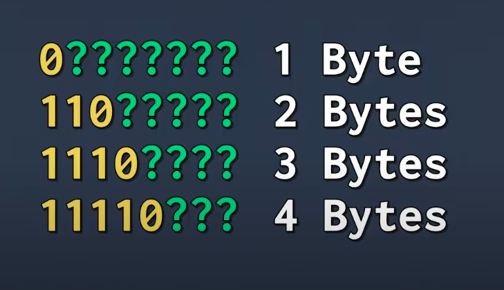
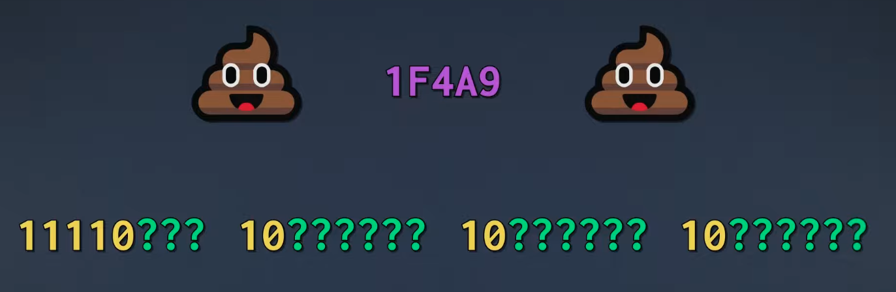
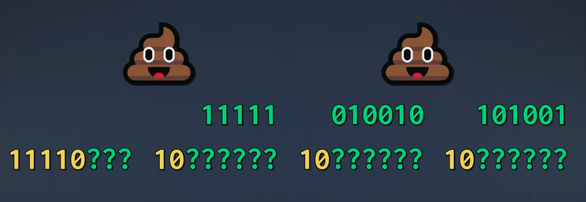
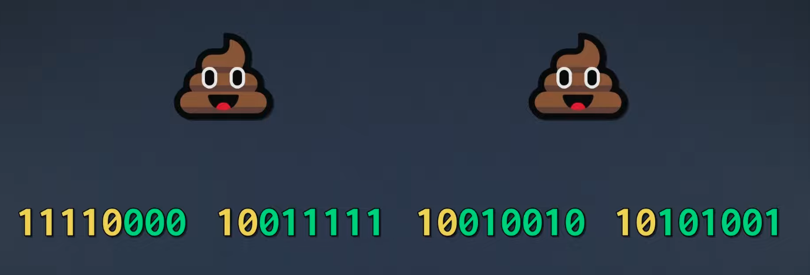
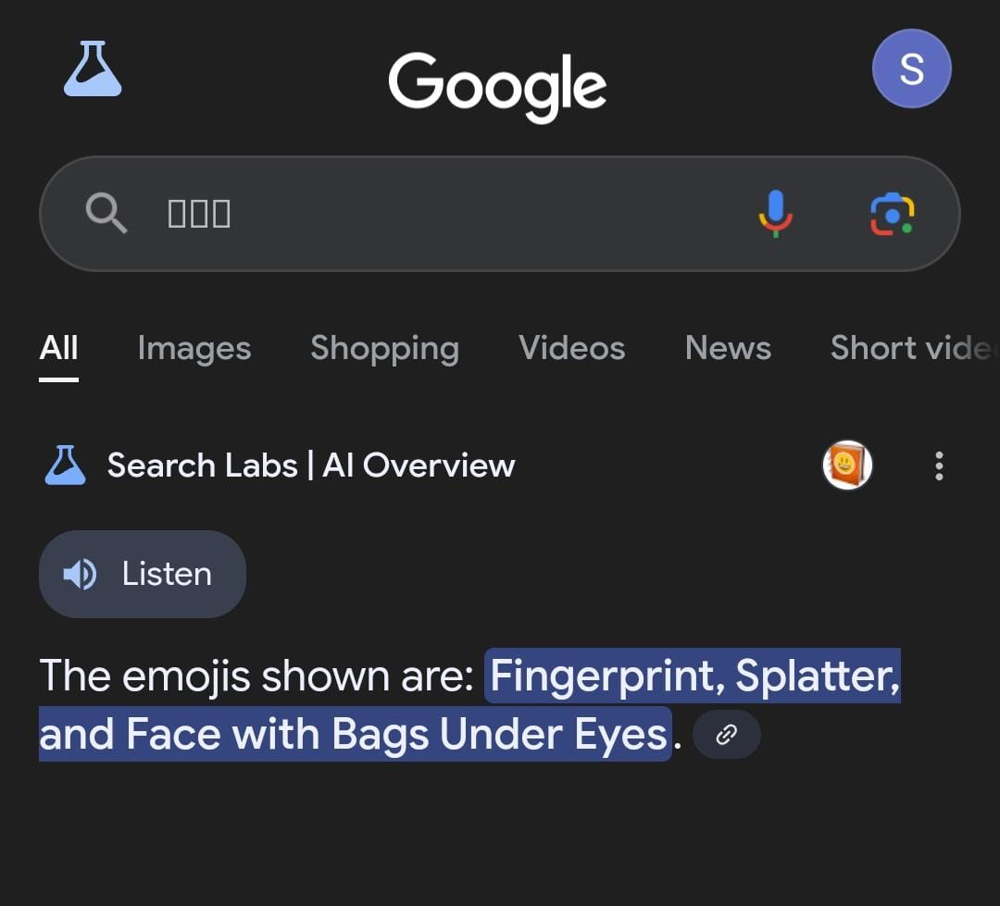
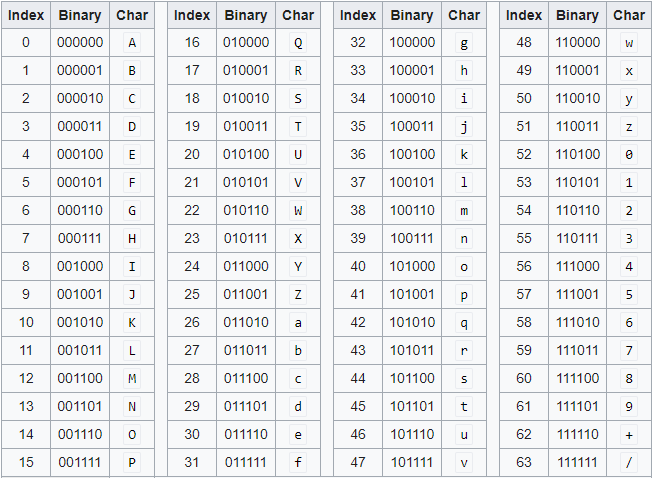

1. What is the diff between UTF and Unicode ? Are they same ?
2. How emojis gets stored in computer ?
3. Is ASCII still used today ?
4. UTF-8 vs UTF-16 vs UTF-32. Which one should we use ?
5. "UTF-8 is backward compatible with ASCII", What does it mean ?

## The Problem : How do we store alphabets, symbols in computer ?

We can easily represent a decimal number as a binary and store it in computer. So, What if we map each character(it can be either alphabet or any symbol) to a unique number and store in computer memory?

Well, that's exactly what ASCII is (**A**merican **S**tandard **C**ode for **I**nformation **I**nterchange), Introduced in 1963, simplest character encoding standard that maps characters to numbers. It uses 7 bits for each character, so total 128 characters are possible `2 ^ 7 = 128` i.e., values from `0` to `127`

Refer to the [ASCII](https://www.cs.cmu.edu/~pattis/15-1XX/common/handouts/ascii.html) chart.

````rust
'A' -> 65 // 01000001 - this is how 'A' gets stored in computer
'B' -> 66
'a' -> 97
'1' -> 49
' ' (space) -> 32```
````

**"Hi"** text gets stored as 0100100001100111 in binary Let's see how:

| Character | ASCII Code | Binary   |
| --------- | ---------- | -------- |
| H         | 072        | 01001000 |
| i         | 103        | 01100111 |

The process of representing **'H'** as 72(01001000) is called encoding. converting back 01001000 into **'H'** is called decoding.

> So no. of characters == no. of bytes in ASCII

But wait most computers in old days used 8-bit bytes (they read and store data in 8-bit chunks). And ASCII uses only 7 bits for each char, **so 1 bit is unused.** That means we can add 128 more characters `2 ^ 8 = 256`. First 128 characters are fixed and the remaining 128 (from 128 to 255) can be customized, depending on the region and language needs.

But what if two people from different countries wants to exchange messages ? leads to lot of confusion right ?

### ASCII Limitations:

- Only english characters are standardised
- No standard for handling characters from other languages like Hindi, Japanese etc..

So we need a universal encoding system where every computer in the world can understand all the languages. If I send some message in Japanese to my friend in US he should be able to see the Japanese. Well that's where **UNICODE** came into the picture.

## UNICODE

A Universal character set introduced in 1991 which includes all the characters from different languages. It's like a big dictionary where a unique code-point(a number basically) is assigned to each character. Even emojis are part of this standard.

As of 2025, total `159,834` unicode-points are assigned to different characters and emojis. Maximum theoretical capacity is `1,114,112` so we have plenty of room for future additions. (remember new emojis gets added yearly ?)

Unicode Point Mapping:

```rust
'H'  -> U+0048 (a hexadecimal value)
'🐱' -> U+1F431
```

The decimal equivalent of U+0048 (Hex -> 0x48) is 72. wondering how ?

> (4 x 16^1 + 8 x 16^0) = 72

If we carefully observe letter `H` in ASCII is also 72. So the first 128 characters in Unicode are same as ASCII to support backward compatibility.

But wait how do we store `U+1F431` in memory ? Remember, **Unicode is not an encoding.** It's just a standard that assigned numbers to all the characters. So we need a encoding mechanism to store the Unicode Points.

That's where UTF(Unicode Transformation Format) comes into the picture. UTF was created by the genius minds **Ken Thompson and Rob Pike**. Yes, the same guys who created Go lang.

A unicode-point takes anywhere between 1-4 bytes. So how about assigning 32-bits for each Unicode Point ? Well, that is what UTF-32 does.

## UTF-32

In this encoding every Codepoint is stored in memory using fixed 32 bits. But you noticed the problem right, it consumes more space. As we have seen already letter `H` Unicode value is U+0048 and it's binary is `01001000`. We just need 8 bits here. But UTF-32 encoding stores it as `00000000000000000000000001001000` lot of space is wasted. Few Unicode points require more space but few require less space. How do we solve this problem and reduce the memory consumption. Well that's where magic happened, we have a new encoding system called UTF-8.

## UTF-8

It's a variable length encoding, uses 1 to 4 bytes per characrer depending on the unicode point. And this is the most widely used encoding system. Wait, If UTF-8 encodes each unicode point in different byte sizes how does it decodes back ? I mean how do we group the next _x_ bytes to display one unicode point ? (_x_ can vary from 1 to 4)

Byte grouping will be done based on the below pattern. If it starts with `11110xxx` then we have to group next 4 bytes to make it as one unicode point.


#### Let's encode one emoji using UTF-8 and see how that works:

💩 Emoji requires 4 bytes so the first byte should look like `11110xxx` and the remaining continuation bytes will look like `10xxxxxx`. And these question marks are empty places where we can store `1F4A9`


If we convert `1F4A9` into decimal we will get `128169` -> `11111010010101001`.
So start from right we can divide our binary and put it in the empty places. And the whole binary gets stored in memory.

<br/>


_[All the above Images are from NoBS Code Youtube Channel]_

### Go uses UTF-8 encoding.

You can verify it by using `len()` function. len() function return the length in bytes

```go
fmt.Println(len("A")) // prints 1
fmt.Println(len("🐱")) // prints 4 - this cat emoji takes 4 bytes in utf-8 encoding
```

> So be careful while iterating through the strings in GO. Use for...range loop instead of for...in

```go
var name = "नमस्ते"

fmt.Println("len of name: ", len(name)) // 18

for i := 0; i < len(name); i++ {
	fmt.Printf("i : %v and char : %c\n", i, name[i])
}

// this is the correct way
for i, unicodePoint := range name {
	fmt.Printf("i : %v byte : %c and rune: %c\n", i, name[i], unicodePoint)
}
```

### How does our computers, phones know when new emojis are added ?

When new emojios are added and if we don't update our software we will see the new emojis like `☐` this.<br/>
🫆🫟🫩 These are few new emojis added in Unicode 16.0 version and I copied them on to my phone google address bar, This is what I got. Google app on my phone is not able to recognize these emojis, so I had to update my google App.


### Base64

**The Problem :** How do we transfer binary data(like images, files) over text-based protocols like HTTP, JSON ?

If we convert each byte into character using ASCII, some of the ASCII characters are non-printable and what if we get `"` double-quote when we convert byte into text ? It will break the JSON right ? So we need a reliable way to represent binary data as printable text. That's where base64 comes into the picture. It groups every 6 bits and replaces the group with corresponding character as per the below table.


```go
str := "Hey"
strInBytes := []byte(str) // [72 101 121]
// H - 72
// e - 101
// y - 121
encoded := base64.StdEncoding.EncodeToString([]byte(msg))
fmt.Println(encoded) // SGV5
```

Base64 encoding of `Hey` -> `SGV5`.<br/> Size of `Hey` is 3 bytes long → 3 × 8 = 24 bits → 24 / 6 = 4 Base64 characters (SGV5).

**Note:** Base64 is only for safely transmitting binary data online, not for storing purpose like ASCII and Unicode.

### Reference Links:

- https://www.unicode.org/consortium/consort.html
- https://www.joelonsoftware.com/2003/10/08/the-absolute-minimum-every-software-developer-absolutely-positively-must-know-about-unicode-and-character-sets-no-excuses/
